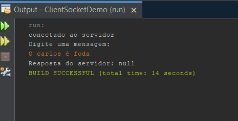
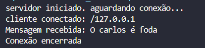

# Sockets

# Desafio do professor

Na última aula o professor nos ensinou sobre sockets, socket que é uma maneira de fazer conexões entre programas, onde você vai estabelecer uma conexão entre servidor e cliente, e o desafio do professor foi tentar estabelecer essa conexão entre esses dois pontos.

# Resultados
A conexão entre os dois pontos foi bem sucedida como podo-se ver nos prints abaixos:

**Cliente**

**Servidor**

